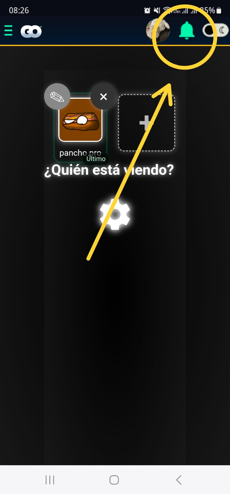
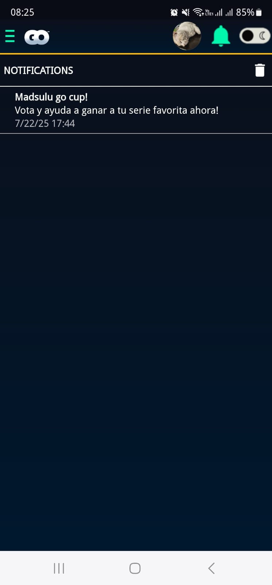
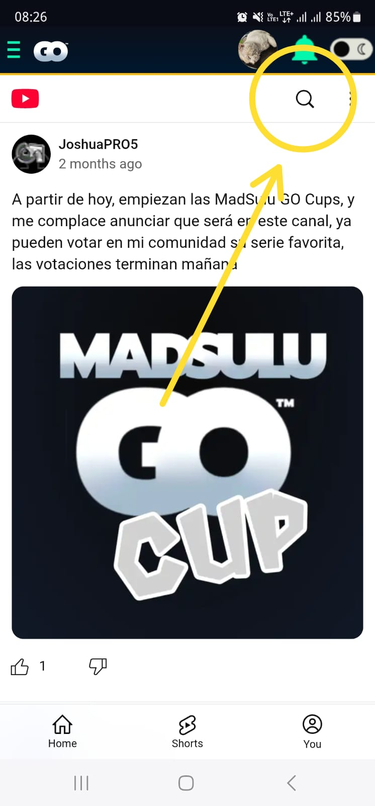
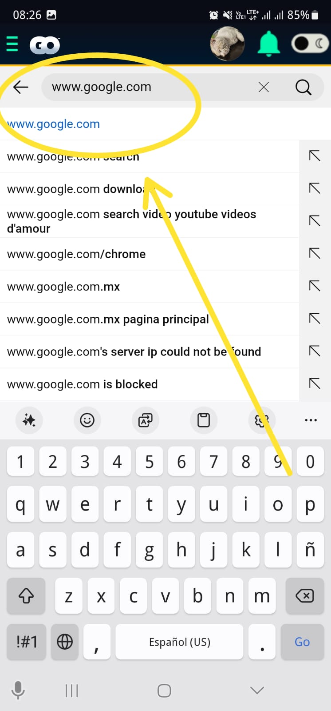
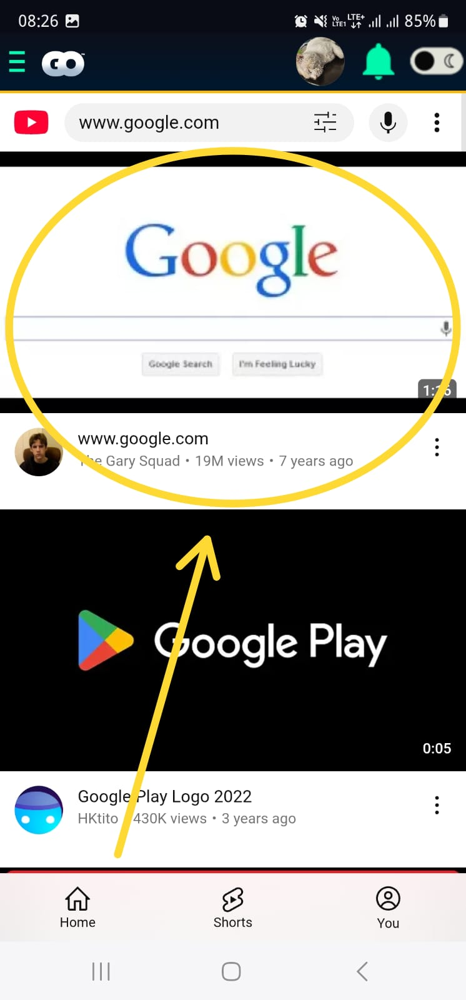
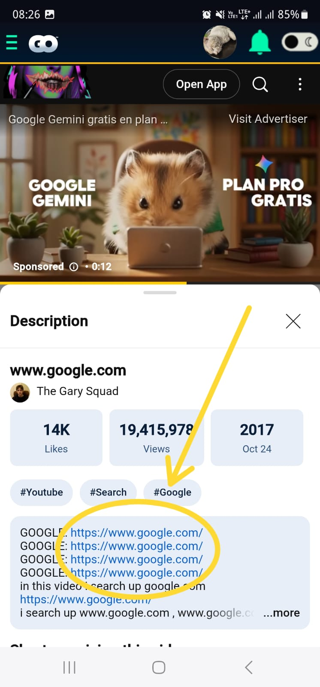
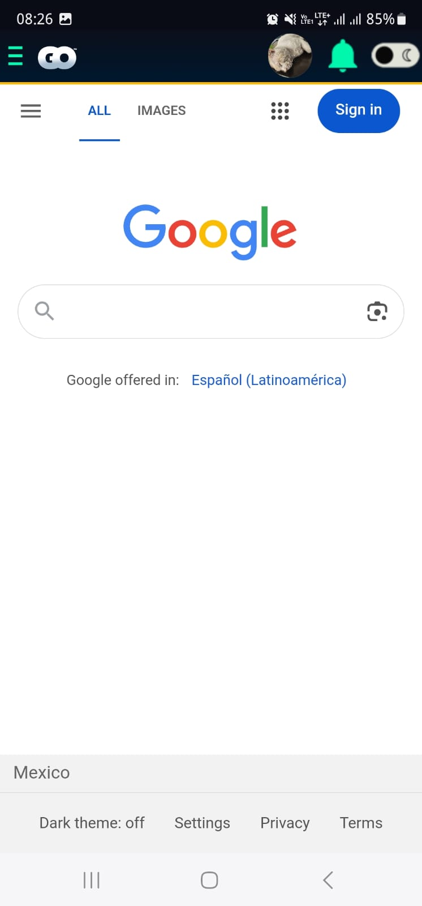

# Bad Notification

Xploit for Madsulu Go based on YouTube.

## About

The July 22nd, 2025 a notification was sent to the app users about the MadSulu Go Cup, an event that was happening on the MadSulu Go YouTube channel.

However, this introduced a vulnerability as tapping the notification opens the YouTube post in the app WebView, meaning that if you find a `google.com` (or any) hyperlink, you'll be able to browse the web.

## Requirements

- Have installed the app before the July 22nd, 2025.
- Not have deleted the in-app notifications.

## Xploit

1. Go to your app notifications
    
   

2. Tap on the MadSulu Go Cup notification
    
   

3. Tap on the search button
    
   

4. Search `www.google.com`
    
   

5. Tap on the first video result
    
   

6. Tap on Description and look for the `www.google.com` links.
    
   

TADA! Now you're on Google 🎉
 

## Notes

This Xploit only allows to escape the app content and browse the web, not to run arbitrary code in the app.
MGH 2.0 allows for arbitrary code execution for there is no ETA for its release.

