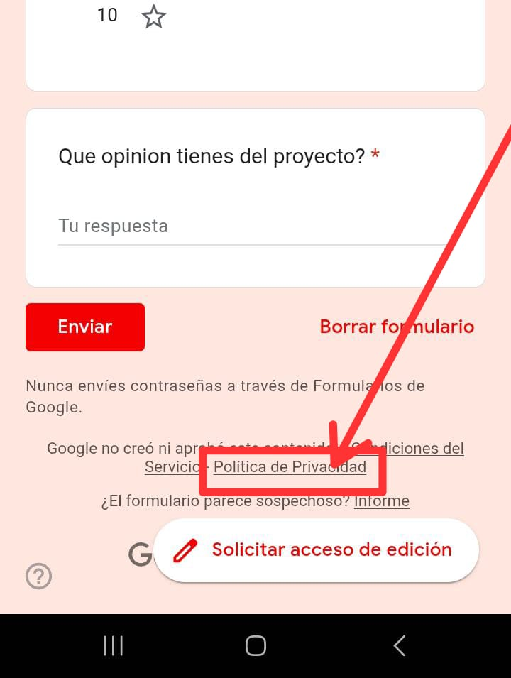
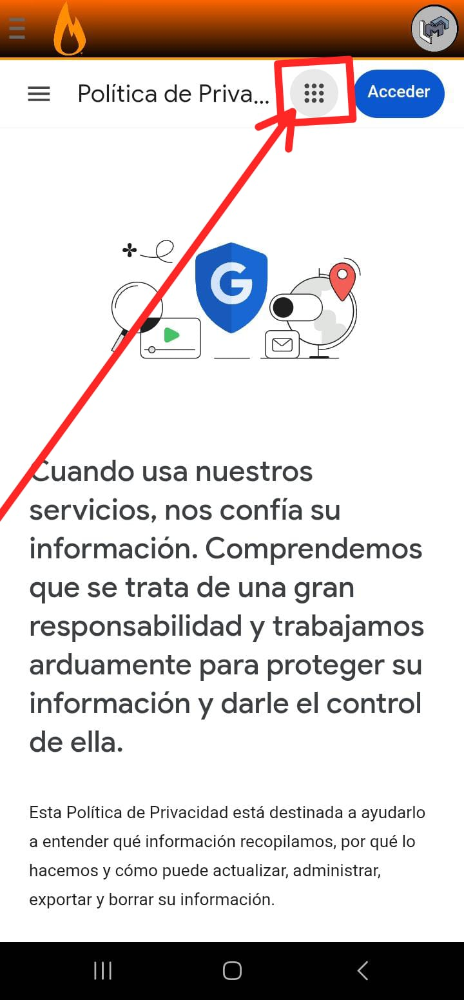
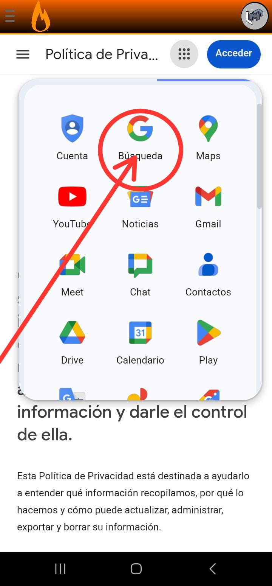

 
<h1>Roasters!</h1>

Roasters is a review app for Madzal Media apps where you can give a rating from 1 to 10. The reviews can appear on the Madzal Media wiki or on official platforms like Madsulu Go (I will talk about Madsulu Go soon).

## About 

In this part of the repository, I will talk about the MGH (Mlc Google Hack) exploit. This exploit uses a vulnerability in Google's login system that, with specific steps, allows you to access the google.com URL. This exploit was ported from the app that I will soon talk about in the future, Madsulu Go. This exploit lets you access the browser of the Roasters app.

## tools

Although we have not used external tools in this port of this exploit, we will provide steps to execute it in the following section.

## Examples

You have to enter any section to leave a review, whichever it may be.

Scroll all the way down, you have to enter the privacy policy.

You will have to click on the 9 little dots

You click on the Google icon and that's it, you're in the browser!!!!

## clarifications

This only allows you to browse the web the one that lets you run arbitrary code is MGH 2.0, which doesn't have an exact release date, and by the way, we don't know when it will be made public.

and that's all

creator and writer: Mlcdev01

porting help: PwLDev

bye bye
